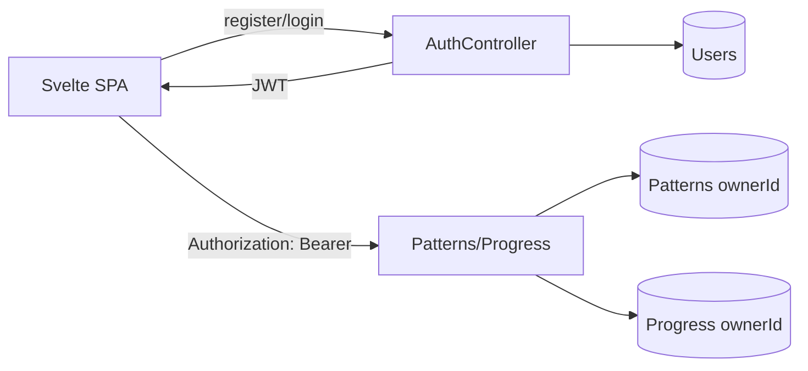

# План простой авторизации через JWT

## Цель

Добавить минимальную регистрацию и вход, чтобы каждый пользователь видел только свои схемы вышивки и свой прогресс. Первый инкремент должен быть небольшим и законченным: email/password, JWT access token, приватные схемы и прогресс.

## Принятые решения

1. Используем JWT в формате `Authorization: Bearer <token>`.
2. На фронтенде храним access token в `localStorage`, потому что приложение сейчас работает как статический SvelteKit SPA.
3. Старые тестовые схемы без владельца не мигрируем. После добавления `ownerId` они перестанут отображаться пользователям; при необходимости их можно удалить из MongoDB и `uploads/` отдельным шагом.
4. Не добавляем refresh tokens, восстановление пароля, подтверждение email и роли в первом инкременте.

## Backend

1. Добавить пользователей:
   - schema/model пользователя в `backend/src/infrastructure/repositories/schemas/user.schema.ts`;
   - поля: `id`, `email`, `passwordHash`, `createdAt`, `updatedAt`;
   - уникальный индекс по `email`;
   - хеширование пароля через `bcrypt`.

2. Добавить auth API:
   - `POST /auth/register` создает пользователя и возвращает JWT;
   - `POST /auth/login` проверяет пароль и возвращает JWT;
   - `GET /auth/me` возвращает текущего пользователя без `passwordHash`.

3. Добавить JWT конфигурацию:
   - `JWT_SECRET`;
   - `JWT_EXPIRES_IN`;
   - payload: `sub` как user id и `email`.

4. Защитить приватные endpoints:
   - `POST /patterns`;
   - `GET /patterns`;
   - `GET /patterns/:id`;
   - `DELETE /patterns/:id`;
   - `GET /progress/:patternId`;
   - `POST /progress/:patternId`;
   - `POST /progress/:patternId/time`.

5. Оставить публичным:
   - `GET /patterns/thread-palettes`.

6. Привязать данные к пользователю:
   - добавить `ownerId` в `Pattern`;
   - добавить `ownerId` в `Progress`;
   - все операции с patterns фильтровать по `(id, ownerId)` или `ownerId`;
   - все операции с progress фильтровать по `(patternId, ownerId)`;
   - при удалении схемы удалять только progress того же владельца.

## Frontend

1. Добавить auth-хранилище в `frontend/src/lib/auth.ts`:
   - чтение/запись токена в `localStorage`;
   - состояние текущего пользователя;
   - `login`, `register`, `logout`.

2. Обновить `frontend/src/lib/api.ts`:
   - добавить методы `register`, `login`, `me`;
   - централизованно добавлять `Authorization: Bearer <token>` для приватных запросов;
   - при `401` очищать токен.

3. Добавить страницы:
   - `frontend/src/routes/login/+page.svelte`;
   - `frontend/src/routes/register/+page.svelte`.

4. Обновить layout и приватные страницы:
   - показывать статус входа и кнопку выхода;
   - перенаправлять неавторизованного пользователя с `/`, `/gallery`, `/workspace/[id]` на `/login`;
   - после успешного входа вести пользователя в `/gallery` или на создание новой схемы.

## Поток данных

## Тестовая стратегия

1. Backend tests:
   - регистрация создает пользователя и хеширует пароль;
   - повторный email возвращает ошибку;
   - логин с корректными данными возвращает JWT;
   - логин с неверным паролем возвращает ошибку;
   - приватные endpoints без токена возвращают `401`;
   - пользователь A не видит и не меняет схемы пользователя B;
   - progress также изолирован по пользователю.

2. Frontend tests:
   - токен сохраняется после login/register;
   - Bearer token подставляется в приватные запросы;
   - logout очищает состояние;
   - `401` сбрасывает авторизацию.

3. Проверки после реализации:
   - `npm test` в `backend`;
   - `npm test` в `frontend`;
   - `npm run check` в `frontend`.

## Порядок реализации

1. Написать backend tests для регистрации, логина, JWT guard и изоляции схем/прогресса по пользователю.
2. Добавить Users/Auth инфраструктуру, JWT config, password hashing и защиту приватных endpoints.
3. Добавить `ownerId` в pattern/progress domain, repository и schemas.
4. Написать frontend tests для auth helper/API wrapper и обработки `401`.
5. Добавить login/register/logout UI и редиректы для приватных страниц.
6. Запустить проверки и исправить найденные регрессии.
